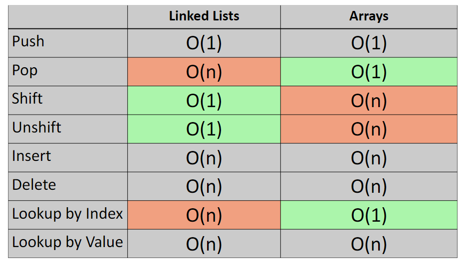

# SINGLY LINKED LISTS

1. Linked lists (singly linked lists) - don't have the indexes like an array and are "all over the place" in memory (arrays are in contiguous place in memory). Linked lists have element called head that points to the first item in linked list and element called tail that points to the last item in list. Each item in the linked list points to the next until the last one which should point to null.

2. Singly linked lists modifying methods:

- pushing onto the end (push) - we need to add the item on the end, by changing what last element points to (it was pointing to null now it will point to our new element). Then we just need to change where the tail is pointing. This way the time we need to add new item to the end of the linked list will be constant (even if the list would be bigger this should not affect the complexity) so the big O for this operation would be O(1),
- removing item from the end (pop) - when we are removing items from linked lists it is a little more tricky. The list element has only information about the next node, so we need to somehow access element that is one before last to: point it's next to null and to point tail onto it. To get this element we must go from the beginning of the list and iterate until we find this node (our one before last node will point to the element we want to remove), then we can set the tail pointer to it and set the next pointer to null. This means that the complexity will be O(n) and would be affect greatly by linked lists number of elements,
- adding item on the beginning (unshift) - we need to set the pointer of new element to point onto the first element in the list, then we need to change the pointer in head to point onto our new element. Complexity for such operation is, like in the case of adding elements to end of linked list, constant O(1),
- removing item from the beginning (shift) - to remove an item we need to change the pointer in the head to new item and remove the first element. This is also not complex operation so the complexity would be O(1),
- inserting element in the middle (insert) - we have to start at the head and look for the item where we want to insert the new element. When we find it we set the new item pointer to point to the element the found item was pointing to and point our found element to the new item in list. This way the complexity will be O(n) because in the worst case scenario we would have to search trough whole list to find the correct spot for our element,
- removing element in the middle (remove) - we have to find the element we want to remove by traversing whole linked list. When we find it we are changing pointer and point proceeding element onto the next element after element we want to remove. The complexity will be O(n),

3. Other singly linked lists methods:

- searching,
  - searching by value - to find an element we are looking for we need to traverse the linked list from top to bottom, so the complexity will be always O(n),
  - searching by index - looking for items by index is the same. We need to traverse whole linked list because even though we know the index we don't know where the item is, only the proceeding item knows it. So the complexity is also O(n),

4. Complexity comparision for basic operations in arrays and linked lists (singly linked lists):



5. Linked list example:

```js
  let thirdEl = {
    value: 2,
    next: null
  }

  let secondEl = {
    value: 2,
    next: thirdEl
  }

  let firstEl = {
    value: 1,
    next: secondEl
  }
```

This way firstEl has info about secondEl within it and we know where to find it in case we want to edit it.
