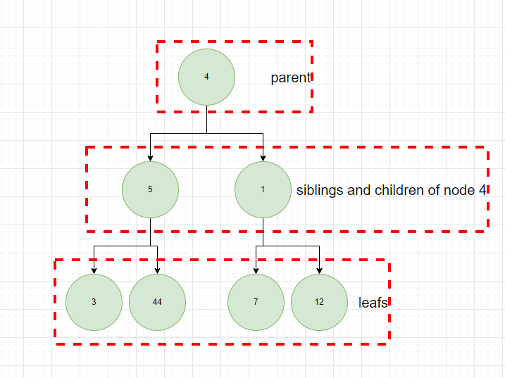
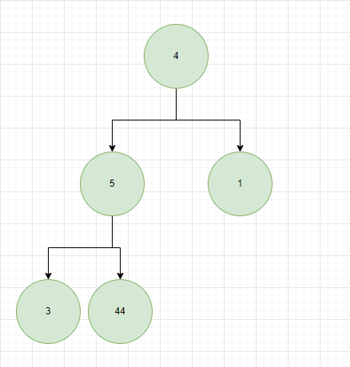
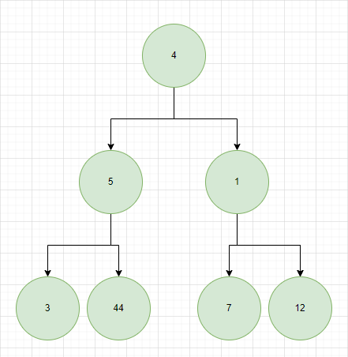
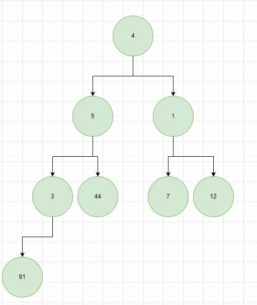
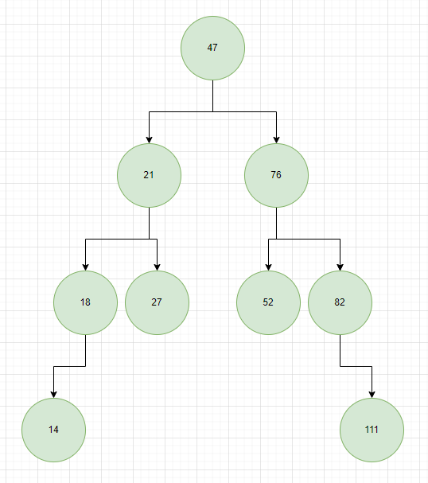

# TREES

1. Tree - tree is a data structure that represents a hierarchical tree like structure with a set of connected nodes. Linked list is a type of a tree where each node has only one branch (this type of tree does not fork). Each node in tree can be connected to many children, but must be connected to exactly one parent (except for the root node, which has no parent). The node, that has connections below is called parent (in diagram below nodes 4, 5 and 1 are parents). Nodes that are connected to parents are called children (in diagram below nodes 5, 1, 3, 44, 7 and 12). Nodes that does not have child nodes are called a leafs (in diagram below nodes 3, 44, 7 and 12). Nodes that stem from the same parent are called siblings (for example 3 and 4 would be siblings in diagram below).

2. Types of trees:

- full - where every item either points to two nodes or zero nodes,

- perfect - where every internal node has exactly two child nodes and all the leaf nodes are at the same level (below example is also a full tree),

- complete - a tree in which every level, except possibly the deepest, is entirely filled (all examples above for full and perfect are also complete),

3. Binary search tree - is a tree where the elements when added are sorted using binary search. We are checking if the element is greater then the root of the tree and then place it either on the left or right. If we have more elements in the tree we need to compare this element to root and then to all the nodes in next level (of given side) until we find an opening in the level (means a place where our new node belongs). This makes the elements in the tree sorted. We can pick any element in the diagram and compare it to the proceeding parents and it should follow the rules. For example node 27 (in diagram below) is greater then parent node 21, but is lesser then root node 47, that's why it is placed on the left side of our root and on the right side of node 21.

4. Binary search tree big O - finding, removing, inserting for such tree will be O($log{n}$) (there is a chance that the tree will look more like linked list and will not branch, then the complexity would be like in linked list O(n), this is worst case and because we will be having more cases that are in the middle it is assumed that the binary tree O is O($log{n}$)). The complexity for all operations will depend upon number of levels in out tree, because tree with 2 levels and 3 elements will have $2^2$ - 1 operations (we can drop the 1 as this does not change a lot in this equation so $2^2$). Tree that has one more level so 7 elements and 3 levels will have $2^3$ - 1 operations. This will be true for all the rest of operations down the line, so number of levels will directly correspond to number of needed operations to do for example insert/delete/find.

5. Divide and conquer in binary search tree - when searching for items in binary tree (also for removing and inserting) we will be using "divide and conquer" method. This means that we will be dividing the tree until either no element is left (the element we searched for does not exist in this tree) or until we are left with one element that is the searched element. We proceed choosing the sides in tree according to our number. So in a tree with numbers, we will compare searched number to the root of our tree and if the number is greater then the root we will discard left side of the tree and move to search in the right, if not, then we will do the opposite. We remove the root and now the root of our tree is the element we choose in previous step. We repeat the actions (checking and removing parts of the tree) with all the elements until we find our node (or until we can state that the searched node does not exist in given tree).  
