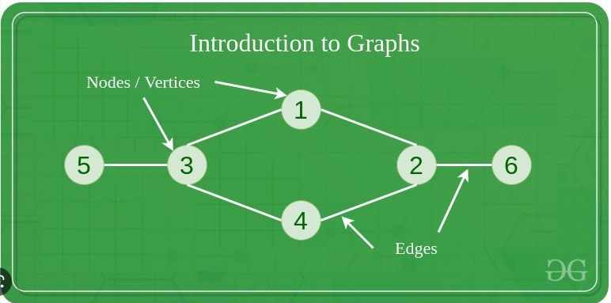
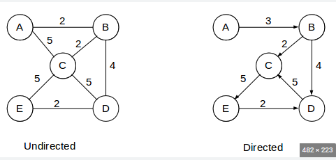
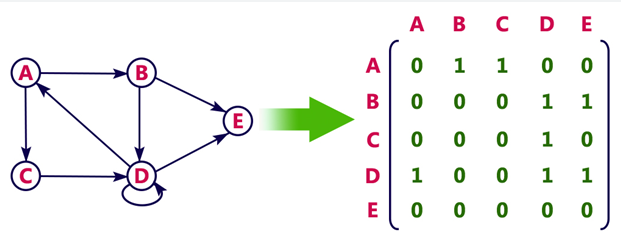
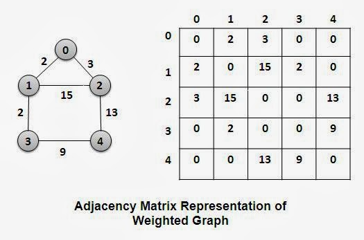
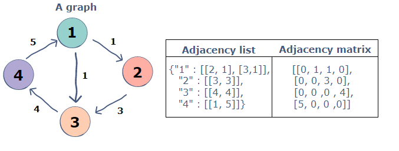

# GRAPHS

1. Graphs - are vertices (or nodes) connected by edges (or connections). Vertices are nodes that are connected with each other with edges. A graph is a nonlinear data structure. A binary tree is an example of graph that has limitation, that each node can point to max 2 other nodes and all connections are directional (linked list is also a graph).

2. Graphs direction - graphs can be undirected, when the flow can be both ways, or can be directed, so the arrow would point to the way we can "go" when using given connection (there is the possibility that the connection will have arrows in the both directions, so this works like no arrow case and you can go both ways).

3. Graphs weight - in the picture above have also numbers next to connections, these are called weighted edges. So when we try to find for example the fastest way to go from node A to node B we should think of a route that would "cost" us the least (choose edges that will amount to the lowest number).

4. Adjacency matrix - this is a matrix where we represent the connections between each node as 0 or 1 (0 for no connection between nodes and 1 for a connection). There is also a version of matrix for graph that has weighted edges, we then instead of 0 and 1 put 0 and weight in the cells.

5. Adjacency list - stores data in object, where key is node and value is an array with nodes that are connected to this node.

6. Big O for adjacency list and matrix basic operation - the complexity depends greatly upon number of connections in both cases (V means nodes/vertices and E means edges/connections):

| | adding node | adding connection | removing node | removing connection |
| :---: | :---: | :---: | :---: | :---: |
| **matrix** | O($\|V\|^2$) | O(1) | O($\|V\|^2$) | O(1)|
| **list** | O(1) | O(1) | O(\|V\| + \|E\|) | O(\|E\|) |

7. Adjacency matrix is very inefficient, when it comes to space complexity, because we are not only storing the information about connections between nodes, but also the information of lack of them (so the info that node A is not connected to B). In comparison the adjacency list stores only the info that is required to represent the graph, so it is better when it comes to space complexity. The space complexity for matrix is O($|V|^2$) and O(V + E) for list.
