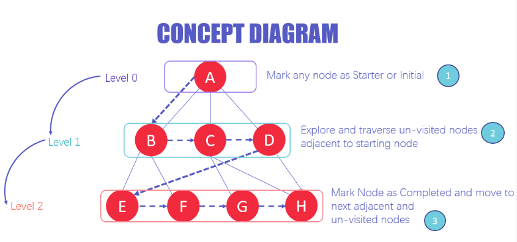
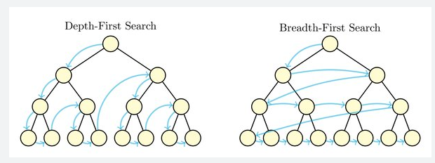
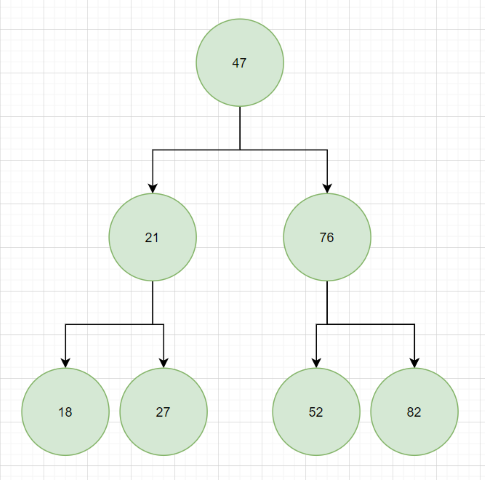

# TREE TRAVERSAL

1. Tree traversal - traversal usually is going from each item from beginning to an end, but in the case of a tree data structure this is more complex. There are few ways to approach traversing a tree:

- breadth first search - we start at the top and traverse nodes by layers from top to bottom and from left to right,

- depth first search - we start all the way to the bottom (to the left), we then go up check if there are any children of this parent node and go up again. We repeat this until we managed to stumble upon our trees root, then start again from the node that is the most left one and repeat steps like before.

  There are 3 types of depth first search:

- pre-order(node-left-right) - visits the root, traverses the left subtree (saving all the nodes that it traverses), always choosing left first (when there is that option) and right when left is already traversed (saved). After traversing left subtree it moves to right one and repeats the steps from before until there are no more items. For diagram below the order of elements returned to us from this traversing should be [47, 21, 18, 27, 76, 52, 82],  
- post-order(left-right-node) - traverses the left subtree, traverses the right subtree, visits the root. Traversing looks almost like in pre-order with small difference being that here we only save an item when it has no more children and the root is the node saved last (which stems from the fact that for root to have no more children to traverse you have to traverse whole tree). For diagram below the order of elements returned to us from this traversing should be [18, 27, 21, 52, 82, 76, 47],
- in-order (left-node-right) - traverses the left subtree, visits the root, traverses the right subtree. Here we will go all the way to the left and save this node if it has no more left nodes. After this we will go to the parent node and save it. From there we cannot go left because we already saved this node so we go right. We again check for left and if there is none we write the node and try to right. If there is none we go to the parents parent. We check if it went already left, we save it and go right. We repeat the precess with right part of the tree. This traversing for binary search tree will result in perfectly sorted list of elements that's why we call it in-order search. For diagram below the order of elements returned to us from this traversing should be [18, 21, 27, 47, 52, 76, 82],

